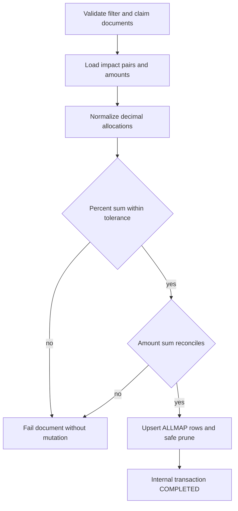
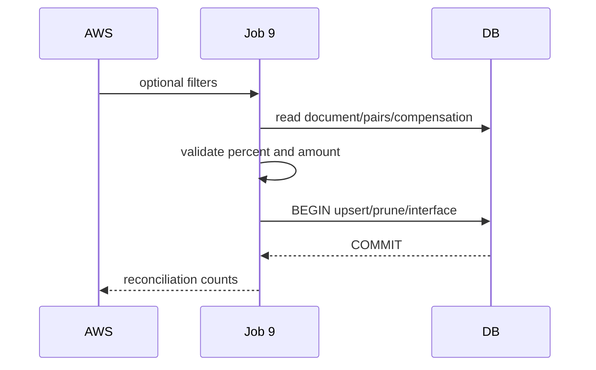

# JOB-09 — SyncNewStoreToDocument

> Contract status: `AS-BUILT` · Document status: `Blocked` · Decision: D-003, D-009, D-012

## 1. รับอะไร ทำอะไร ส่งผลไปไหน

อ่านคู่ร้าน/ยอดชดเชยร้านใหม่ของรอบ แล้ว upsert `sgi_document_new_stores` พร้อม percent/amount โดย preserve แถว USER และตรวจผลรวมก่อน commit

## 2. AS-BUILT เทียบ requirement

TypeScript แทนไฟล์ BPM06002O legacy ด้วย DB sync เพิ่ม decimal allocation validator, sum 100, amount reconciliation, prune fuse, timeout และ tests

## 3. Schedule, trigger และ dependency

reference 17:45 วันที่ 7–31; หลัง Job 8 และข้อมูล compensation จาก Job 6; Job 8b/detail ต้องเห็นข้อมูลหลัง commit

## 4. INPUT และ environment variables

`{"docNo":"2026/00001","impactedStoreCode":"01234","compensateMonth":"2026-08","datasource":"","dryRun":false}` Keys: datasource/sourceSystem ALLMAP, percent target 100, base/per-row tolerance, amount tolerance, chunk/mail/prune guards

## 5. Flowchart

## 6. Sequence Diagram

## 7. Decision Rules

| Rule | ผล |
|---|---|
| effective amount | adjust ก่อน forecast; retain provenance |
| percent total | target 100 within configured decimal tolerance |
| amount per store | BE/Job calculate with deterministic residual allocation |
| amount total != impacted total beyond tolerance | fail/rollback document |
| source USER row | preserve; no prune/overwrite |
| empty source mass impact | fuse fail closed |

## 8. Source-to-target field mapping

pair `new_store_code`, distance/source → document row; new-store compensation percent/forecast/adjust → `compensate_percent`, `compensation_amount`; document `doc_no`; store metadata from approved source/snapshot

## 9. SQL และตารางที่อ่าน/เขียน

R: document, process, impact store, impact/new-store compensation; W: `sgi_document_new_stores`, `sgi_interface_transactions`

## 10. Transaction boundary

validate complete allocation before mutation; per document/chunk upsert+prune+internal transaction atomic

## 11. Idempotency, lock, rerun และ concurrent execution

unique `(doc_no,new_store_code)`; advisory Job 9; rerun converges; source-scoped prune; document edit concurrent conflict policyต้องไม่ทับ USER

## 12. File/message/API contract

ไม่มี legacy file; target fieldsตรงกับ GET/PUT document (`newStoreCode`, `compensatePercent`, `compensationAmount`, `sourceSystem`)

## 13. Retry, rollback, DLQ/outbox และ error notification

consistency failure no retry until data fixed; DB transient scheduler retry; rollback document; internal txn/status/mail observable

## 14. Metrics และ log

documents/rows, inserted/updated/pruned/preservedUser, percent/amount mismatch, residual adjustments, fuse, duration

## 15. Code path จริง

ตรวจสามชั้น: [คำอธิบายกฎ](../../batchjob/JOB-09-SyncNewStoreToDocument-อธิบายละเอียด.md) · Java `main/ExportOpenStore.java`, `ExportController.manageOpenNewStoreToBPM`, `ExportJdbc.queryOpenNewStore` · TypeScript `job-9-sync-new-store-to-document.service.ts`, input DTO, allocation validator/matrix/svc specs

## 16. Test

100 sum boundaries/tolerance per row, money residual, adjust precedence, duplicate, user preserve, prune/fuse, concurrent/rerun/PostgreSQL

## 17. Runbook local/AWS Batch

dryRun single doc; `JOB_NAME=sgi-sync-new-store-to-document INPUT='{"docNo":"2026/00001","dryRun":true}' npm run start`; reconcile source/target percent+amount

## 18. BLOCKED

D-003 source mapping, D-009 STA adjustment conflict, D-012 dependencies; Businessรับรอง tolerance/residual policy and master snapshot behavior
