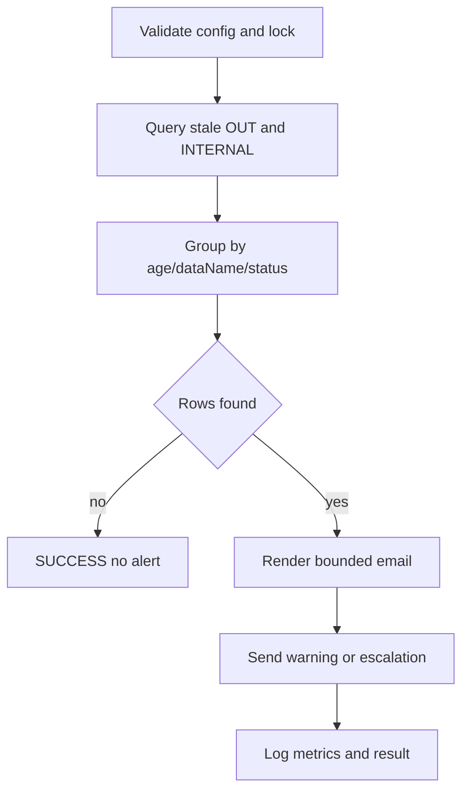
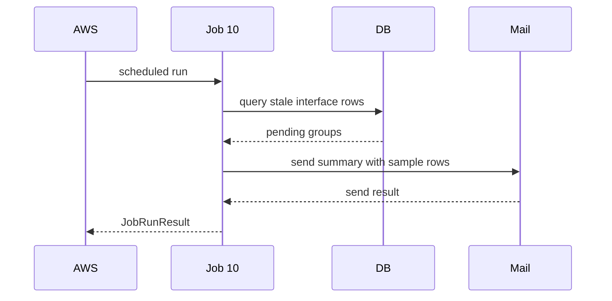

# JOB-10 — NotifyNoReceiveData

> Contract status: `AS-BUILT` · Document status: `Blocked` · Decision: D-006, D-012

## 1. รับอะไร ทำอะไร ส่งผลไปไหน

watchdog อ่าน interface transaction ที่ค้าง: OUT ยังไม่ `CONFIRMED` เกินเกณฑ์ และ optional INTERNAL ยังไม่ terminal แล้วจัดกลุ่มส่งอีเมลเตือน/ยกระดับโดยไม่แก้ธุรกิจต้นทาง

## 2. AS-BUILT เทียบ requirement

TypeScript เปลี่ยนคำว่า ACK เป็น publisher confirm ตาม STA contract, เฝ้าทั้ง OUT และ INTERNAL ตาม config, มี age/escalation/count tests และไม่รายงาน success หาก core query ล้ม

## 3. Schedule, trigger และ dependency

reference daily 08:00; อ่านผลของ Jobs 4/6/7/8/9 และ publisher; ไม่ block pipeline แต่ alarm ต้องมี owner

## 4. INPUT และ environment variables

simple `{"dryRun":false}` Keys: `SGI_JOB10_PENDING_AGE_DAYS=1`, `ESCALATE_DAYS=3`, `INTERNAL_AGE_DAYS=3`, data names, watch internal, template id, max rows, mail recipients, `mas_param` override

## 5. Flowchart

## 6. Sequence Diagram

## 7. Decision Rules

| Rule | ผล |
|---|---|
| OUT `outbox_status != CONFIRMED` และ age ≥1 | warning |
| age ≥3 | escalation |
| INTERNAL status not COMPLETED/FAILED และ age ≥ configured | warning when enabled |
| `direction=IN` consumer record | ไม่ใช้ publisher-confirm rule |
| no recipient | count alertable rows + fail/warn ตาม production policy; ห้ามเงียบ |
| same row next day | เตือนได้อีกตาม cadence; marker/dedup policyต้องชัด |

## 8. Source-to-target field mapping

interface id/dataName/direction/status/outboxStatus/businessKey/createdAt/retry → email row; thresholdsจาก env/`mas_param`; ไม่มี domain target

## 9. SQL และตารางที่อ่าน/เขียน

R: `sgi_interface_transactions`, `mas_param`; W: ไม่มี SGI business table อาจเขียน email send log ผ่าน shared library owner

## 10. Transaction boundary

read snapshot แล้วส่ง email outside transaction; mail failureไม่แก้ row; job statusสะท้อน notification policy

## 11. Idempotency, lock, rerun และ concurrent execution

advisory Job 10; rerunอาจส่งซ้ำอย่างตั้งใจตาม cadence; future marker ต้อง unique ต่อ row+alert tier+date

## 12. File/message/API contract

email subject/body templateมี count/oldest age/dataName/status/sample business keys; ห้ามแนบ payload/secret/PII

## 13. Retry, rollback, DLQ/outbox และ error notification

query fail → FAILED; mail transient bounded by library/scheduler; ห้ามใช้ outbox ที่กำลังตรวจเพื่อแจ้งตัวเอง; operations alarm fallback เมื่อ email fail

## 14. Metrics และ log

pendingOut, pendingInternal, warning/escalation, oldestAge, byDataName/status, rowsTruncated, mailSent/mailFailed, duration

## 15. Code path จริง

ตรวจสามชั้น: [คำอธิบายกฎ](../../batchjob/JOB-10-NotifyNoReceiveData-อธิบายละเอียด.md) · Java `main/NotifyNoReceiveData.java`, `ManageCompensateController.genMessageMailNotifyNoReceiveData`, `ExportJdbc.queryNotifyNoReceiveData` · TypeScript `job-10-notify-no-receive-data.service.ts`, simple input, Job 10 `__svc__` specs

## 16. Test

age boundary/timezone, CONFIRMED exclusion, OUT/INTERNAL scope, filters, escalation, no rows, no recipient, mail failure, rerun/lock/query timeout

## 17. Runbook local/AWS Batch

ตั้ง template/recipient; dryRun; `JOB_NAME=sgi-notify-no-receive-data INPUT='{}' npm run start`; ตรวจ oldest backlog แล้ว replayที่ producer runbook ไม่แก้ statusด้วยมือ

## 18. BLOCKED

D-006 sender/template/recipient/escalation owner, D-012 schedule/alarm; Business/Operations รับรอง repeat-notification marker/cadence
