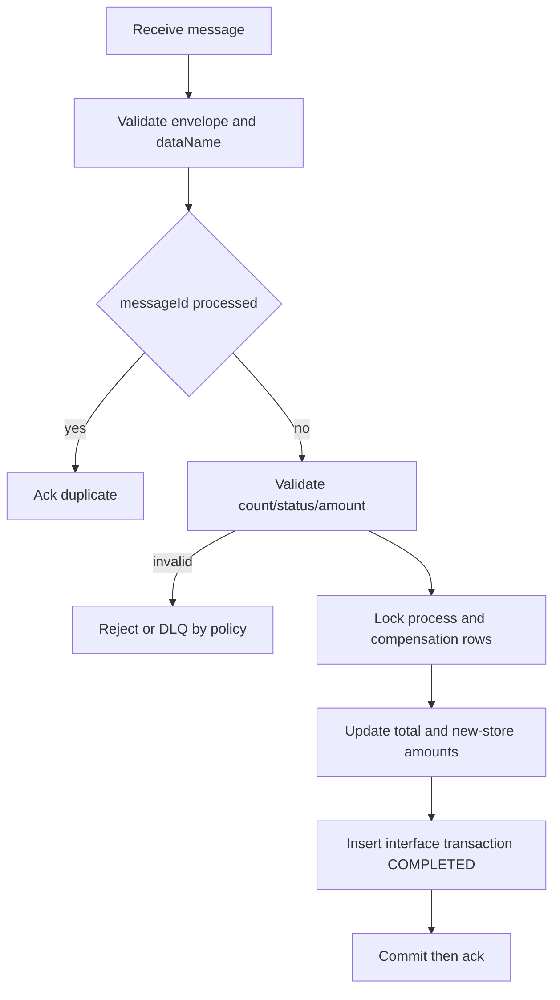
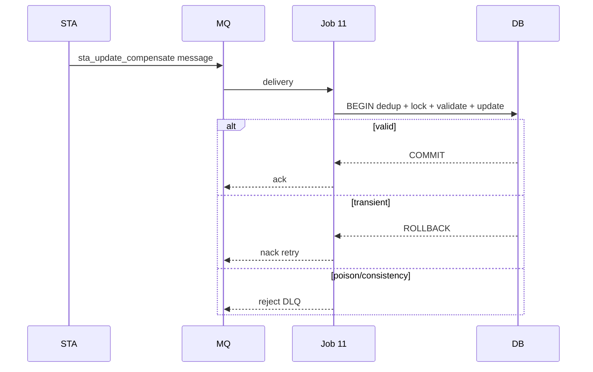

# JOB-11 — ConsumeStaCompensate

> Contract status: `AS-BUILT` target-only · Document status: `Blocked` · Decision: D-005, D-009, D-012

## 1. รับอะไร ทำอะไร ส่งผลไปไหน

consume RabbitMQ message `sta_update_compensate`, validate envelope/count/status/amount, dedup, lock impact process แล้วอัปเดตยอดรวมและยอดแยกร้านใหม่พร้อม interface transaction; ack เมื่อ commit สำเร็จ, retry/DLQ เมื่อไม่ได้

## 2. AS-BUILT เทียบ requirement

ไม่มี Java legacy ของ Job 11—ระบบเดิมรับ STA ผ่าน web service ดังนั้น TypeScript และ STA message spec คือ target implementation มี consumer/payload/consistency/DLQ tests แต่ deployment model ยัง Blocked

## 3. Schedule, trigger และ dependency

Rabbit delivery ไม่ใช่ cron; default runnerออกเมื่อ idle 60s; ต้อง deployหลัง Job 6/STA และ coordinate กับ Job 9/document updates

## 4. INPUT และ environment variables

simple `{"dryRun":false}` สำหรับ runner; message เป็น broker input Keys: queue `srm.sgi.sta-update-compensate.queue`, DLQ, prefetch 10, max attempts 3, idle 60, consistency policy/dead-letter kinds, unknown new store policy, closed document policy update, mail

## 5. Flowchart

## 6. Sequence Diagram

## 7. Decision Rules

| Rule | ผล |
|---|---|
| `dataName` ไม่ตรง | reject/DLQ ไม่แตะ DB |
| messageId เคย COMPLETED | ack no-op |
| count/status/amount consistency mismatch | default DLQ ตาม configured kinds |
| new store ไม่พบ | default DLQ; `warn` ต้อง business sign-off |
| closed document | default update; policy D-009 |
| transient DB/network และ attempts <3 | nack/requeue |
| attemptsครบ | DLQ + alert |

## 8. Source-to-target field mapping

message id/business key → interface transaction; impacted store/period/amount/status → process + `sgi_fgi_impact_compensations`; `compensate[]` code/percent/amount → `sgi_fgi_new_store_compensations` และ document new stores; document/history updateเมื่อมี doc

## 9. SQL และตารางที่อ่าน/เขียน

R/W: `sgi_interface_transactions`, process, impact compensation, new-store compensation, `sgi_compensation_documents`, `sgi_document_new_stores`; ทุก lookup business keyต้องได้หนึ่งแถวหรือ fail consistency

## 10. Transaction boundary

หนึ่ง message ต่อ DB transaction: dedup row + locks + all money/status/history/interface; ack หลัง commit เท่านั้น

## 11. Idempotency, lock, rerun และ concurrent execution

messageId unique, business version/key guard, row lock process/doc; redeliveryหลัง commit ack lost = no-op; prefetchจำกัด parallelismแต่ไม่แทน DB lock

## 12. File/message/API contract

Rabbit envelope `dataName=sta_update_compensate`, messageId และ payload impacted store/period/status/total plus `compensate[]`; schema/version/routingต้องตรง STA specและ reject unknown/invalid number

## 13. Retry, rollback, DLQ/outbox และ error notification

transient retry max attempts; poison/business inconsistency DLQ; no partial money update; DLQ replayต้องใช้ original messageId หลังแก้ข้อมูลและมี audit ticket

## 14. Metrics และ log

received/valid/duplicate/updated/retried/dlq, unknownStore, closedDoc, mismatch kind, amounts/counts, processing latency, queue/DLQ depth; mask payload personal data

## 15. Code path จริง

ตรวจสามชั้นโดยระบุช่องว่าง: [คำอธิบายกฎ/STA contract](../../batchjob/JOB-11-ConsumeStaCompensate-อธิบายละเอียด.md) · Java: **ไม่มี implementation เดิม** (legacy เป็น inbound web service) · TypeScript `job-11-consume-sta-compensate.service.ts`, message parser, Rabbit consumer, unit/`__svc__` specs

## 16. Test

schema/envelope/unknown fields, duplicate/redelivery, count-status-amount mismatch, new store/closed doc policies, row lock/concurrency, ack-after-commit, retry/max/DLQ, money/document reconciliation

## 17. Runbook local/AWS Batch

ตั้ง MQ/queue/DLQ; start `JOB_NAME=sgi-consume-sta-compensate INPUT='{}' npm run start`; monitor idle exit/depth; replay DLQด้วย approved tooling ห้าม copy payloadแก้มือ

## 18. BLOCKED

D-005 long-running vs AWS Batch idle consumer/scaling ownership, D-009 unknown/closed consistency, D-012 retry/DLQ resource; STA sign-off schema/version/routing essential
