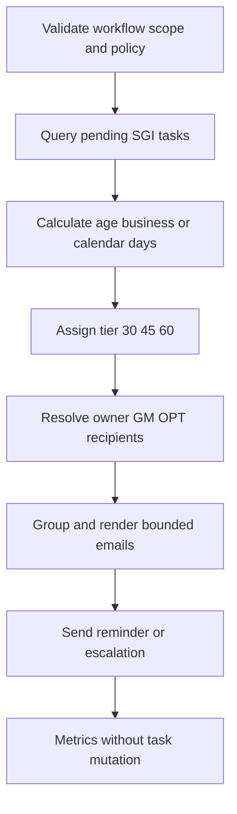
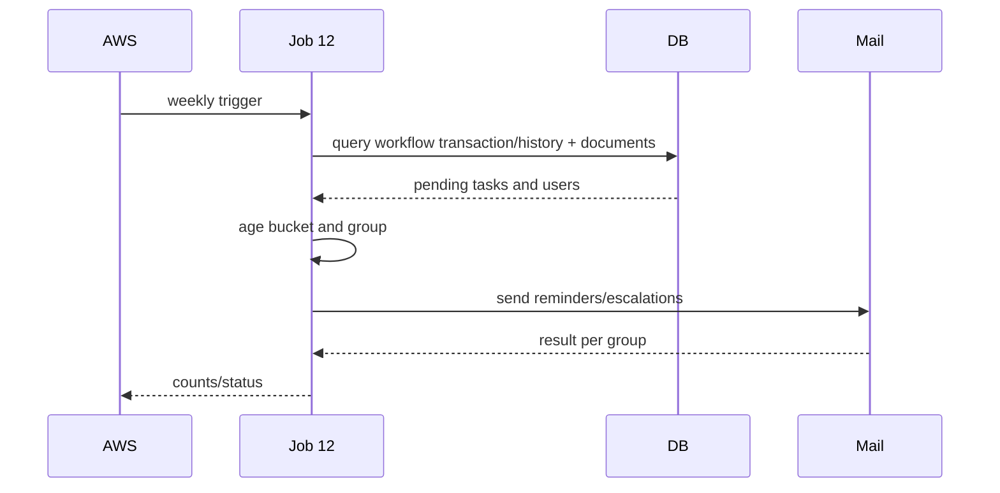

# JOB-12 — NotifyPendingWork

> Contract status: `AS-BUILT` · Document status: `Blocked` · Decision: D-004, D-006, D-010, D-012

## 1. รับอะไร ทำอะไร ส่งผลไปไหน

อ่านงาน workflow SGI ที่ค้าง จัด bucket อายุ ส่ง reminder ให้ผู้รับผิดชอบและ escalation ให้ GM/OPT ตาม policy โดยไม่เปลี่ยนสถานะงาน

## 2. AS-BUILT เทียบ requirement

TypeScript ใช้ workflow version scope, TIERED 30/45/60, business-day option, recipient/group resolution, query timeout และ tests; ต่างจาก legacy window แคบที่อาจไม่เตือนต่อ

## 3. Schedule, trigger และ dependency

reference Monday 10:00; หลัง Job 8b เปิด workflow; holiday/calendar และ workflow versionต้องพร้อม

## 4. INPUT และ environment variables

simple `{"dryRun":false}` Keys: `BUCKET_MODE=TIERED`, tiers 30/45/60, legacy window 6, `DAY_COUNT=BUSINESS`, states, workflow version IDs, GM group 38, OPT group 15, weekly/escalation template, timeout 60s, max rows 200, mail

## 5. Flowchart

## 6. Sequence Diagram

## 7. Decision Rules

| Rule | ผล |
|---|---|
| workflow versionไม่อยู่ allowlist | ไม่รวม |
| task terminal/closed | ไม่รวม |
| age < first tier | ไม่ส่ง |
| TIERED 30/45/60 | reminder/escalateตาม tier; งานเก่าไม่ตกช่อง |
| BUSINESS | นับวันทำการตาม approved calendar; D-010 |
| owner email missing | fallback/escalate + metric; ห้าม drop เงียบ |
| no rows | SUCCESS no email |

## 8. Source-to-target field mapping

workflow reference/status/created/history + document docNo/store/section → mail row; business_user/group/store zone → recipient; age policy → tier/template; ไม่มี SGI target mutation

## 9. SQL และตารางที่อ่าน/เขียน

R: `workflow_transaction`, `workflow_history`, `sgi_compensation_documents`, `business_user`, `mas_store` และ group relationsตาม schemaจริง; W: email send logผ่าน owner libraryเท่านั้น

## 10. Transaction boundary

read queryมี timeout/snapshot; email outside transaction; ไม่มี task status update; partial mail failureต้องรายงาน per group

## 11. Idempotency, lock, rerun และ concurrent execution

advisory Job 12; rerunอาจส่งซ้ำตาม approved cadence; notification marker designถ้าต้อง exactly-onceต้อง Decision/ตาราง owner

## 12. File/message/API contract

email template weekly/escalation มี docNo/store/section/owner/age/link; linkต้องเป็น approved FE base URL; จำกัด rows และแนบ summary ไม่เผยข้อมูลเกินสิทธิ์

## 13. Retry, rollback, DLQ/outbox และ error notification

query timeout/db fail → FAILED; mail transient bounded; per-recipient failure collected; operational alarm fallback; no DLQ/outbox currently

## 14. Metrics และ log

pending by section/tier, owners/groups, noRecipient, sent/failed/truncated, oldestAge, query/mail duration; no full email/personal details in log

## 15. Code path จริง

ตรวจสามชั้น: [คำอธิบายกฎ](../../batchjob/JOB-12-NotifyPendingWork-อธิบายละเอียด.md) · Java `main/SendMailReport.java`, `MailReportService.java` · TypeScript `job-12-notify-pending-work.service.ts`, pending buckets, workflow scope helper, matrix/svc specs

## 16. Test

tier boundaries, business/calendar/holiday, legacy mode gaps, workflow scope/states, terminal exclusion, recipients/fallback, template/row limit, timeout/mail failure/rerun/lock

## 17. Runbook local/AWS Batch

ตั้ง version IDs/calendar/group/template/recipient; dryRun; `JOB_NAME=sgi-notify-pending-work INPUT='{}' npm run start`; reconcile countsกับ workflow UI และตรวจ noRecipient ก่อนส่งจริง

## 18. BLOCKED

D-004 workflow scope, D-006 group/template/sender/link, D-010 approved days/tiers/cadence, D-012 schedule; Business/HR/Auth ownerยืนยัน group IDs 15/38 และ email fields
