# ER Diagram ฉบับสมบูรณ์ — SGI + ฐานข้อมูลระบบ SBP เดิม

> สร้างอัตโนมัติด้วย `python3 tools/build_er_diagram.py` — **ห้ามแก้ไฟล์นี้ด้วยมือ**  
> แหล่งข้อมูล: `LLDD/md/LLDD-Database.md` (DDL 20 ตาราง) · `SBP/db-schema-sps_store.md` · `SBP/db-schema-sps_auth.md` (ดึงฐานจริง 07/08/2026) · `database.md` (Cross-System Keys)  
> รูป: `er-sgi-complete.svg` (เวกเตอร์) · `er-sgi-complete.png` · `er-sgi-complete.html` (โต้ตอบได้ · มีภาคผนวกตารางครบทุกตาราง)

**บนรูป:** 70 ตาราง (20 SGI · 39 sps_store · 11 sps_auth) · 153 ความสัมพันธ์

## โซน A · FGI/FCS Impact Pipeline

ตารางใหม่ของ SGI — ค้นฐานจริง 276 ตารางแล้วไม่มีของเดิมให้ reuse

| ตาราง | คอลัมน์ | PK | ความสัมพันธ์ออก | แถวจริง |
|---|---|---|---|---|
| `sgi_fgi_impact_processes` | 18 | id | ออก 2 · เข้า 6 | — |
| `sgi_fgi_impact_compensations` | 18 | id | ออก 2 · เข้า 0 | — |
| `sgi_fgi_impact_stores` | 12 | id | ออก 4 · เข้า 0 | — |
| `sgi_fgi_impact_sales_summaries` | 8 | id | ออก 1 · เข้า 2 | — |
| `sgi_sales_transactions` | 9 | id | ออก 1 · เข้า 0 | — |
| `sgi_fgi_impact_competitors` | 9 | id | ออก 3 · เข้า 0 | — |
| `fcs_qssi_score` | 7 | id | ออก 1 · เข้า 0 | 23,958,780 |
| `sgi_interface_transactions` | 24 | id | ออก 4 · เข้า 0 | — |

## โซน B · K2 เอกสารประกันรายได้

แกนเอกสาร + ประวัติ — workflow ใช้ engine กลาง ไม่สร้างตารางเอง

| ตาราง | คอลัมน์ | PK | ความสัมพันธ์ออก | แถวจริง |
|---|---|---|---|---|
| `sgi_compensation_documents` | 25 | id | ออก 13 · เข้า 9 | — |
| `sgi_document_running_numbers` | 3 | year | ออก 1 · เข้า 0 | — |
| `sgi_document_new_stores` | 8 | id | ออก 2 · เข้า 1 | — |
| `sgi_document_cost_details` | 10 | id | ออก 2 · เข้า 0 | — |
| `sgi_document_competitors` | 12 | id | ออก 2 · เข้า 1 | — |
| `sgi_document_external_factors` | 8 | id | ออก 2 · เข้า 0 | — |
| `sgi_consideration_logs` | 9 | id | ออก 5 · เข้า 0 | — |
| `sgi_document_attachments` | 16 | attach_id | ออก 4 · เข้า 0 | — |
| `sgi_compensation_histories` | 8 | id | ออก 3 · เข้า 0 | — |

## โซน C · Master ที่ SGI เป็นเจ้าของ

3 ตาราง — ที่เหลือใช้ master ของระบบ SBP เดิม

| ตาราง | คอลัมน์ | PK | ความสัมพันธ์ออก | แถวจริง |
|---|---|---|---|---|
| `sgi_impacted_stores` | 7 | store_code | ออก 5 · เข้า 4 | — |
| `sgi_competitors` | 6 | competitor_code | ออก 0 · เข้า 2 | — |
| `sgi_external_factors` | 5 | factor_code | ออก 0 · เข้า 1 | — |

## Workflow Engine · @srm/glb-workflow

13 ตารางใน schema sps_store · library กลาง — SGI ขอ version ใหม่ 1 ตัว ห้ามสร้างตารางเอง/ห้ามแก้ DDL

| ตาราง | คอลัมน์ | PK | ความสัมพันธ์ออก | แถวจริง |
|---|---|---|---|---|
| `workflow` | 4 | — | ออก 0 · เข้า 1 | — |
| `workflow_version` | 10 | — | ออก 5 · เข้า 7 | — |
| `workflow_state` | 4 | — | ออก 1 · เข้า 12 | 18 |
| `workflow_status` | 4 | — | ออก 1 · เข้า 7 | 22 |
| `workflow_event` | 2 | — | ออก 0 · เข้า 3 | — |
| `workflow_route` | 11 | route_id | ออก 7 · เข้า 0 | 43 |
| `workflow_group` | 3 | — | ออก 0 · เข้า 3 | — |
| `workflow_group_map` | 5 | — | ออก 1 · เข้า 0 | — |
| `workflow_transaction` | 9 | — | ออก 4 · เข้า 3 | 19,283 |
| `workflow_approver` | 11 | approver_id | ออก 5 · เข้า 0 | 96,542 |
| `workflow_history` | 12 | history_id | ออก 8 · เข้า 1 | 38,010 |
| `workflow_part` | 4 | part_id | ออก 1 · เข้า 1 | — |
| `workflow_part_display` | 5 | — | ออก 3 · เข้า 0 | — |

## SBP Platform · schema sps_store

198 ตาราง — แสดง 24 ตารางที่ SGI ใช้ · ระบบเดิมเป็นเจ้าของ SGI อ่าน/เรียก API เท่านั้น เพิ่มคอลัมน์ต้อง sign-off

| ตาราง | คอลัมน์ | PK | ความสัมพันธ์ออก | แถวจริง |
|---|---|---|---|---|
| `store` | 32 | store_id | ออก 1 · เข้า 14 | 19,402 |
| `mas_store` | 31 | branch_id | ออก 2 · เข้า 3 | 19,647 |
| `sevenshop` | 56 | — | ออก 2 · เข้า 1 | 15,308 |
| `fr_store` | 85 | — | ออก 4 · เข้า 2 | 11,583 |
| `fr_store_insure` | 11 | — | ออก 1 · เข้า 1 | 708 |
| `juristic` | 24 | — | ออก 1 · เข้า 1 | 7,603 |
| `franchisee` | 86 | franchisee_id | ออก 0 · เข้า 3 | 7,885 |
| `store_organize` | 18 | — | ออก 3 · เข้า 0 | 79,722 |
| `fml_responsible_sbp` | 11 | responsible_sbp_id | ออก 1 · เข้า 0 | 101 |
| `business_user` | 36 | — | ออก 3 · เข้า 12 | 12,752 |
| `business_user_group` | 14 | — | ออก 2 · เข้า 0 | 11,409 |
| `business_group` | 11 | group_id | ออก 1 · เข้า 4 | 126 |
| `common_code` | 14 | — | ออก 1 · เข้า 4 | 2,609 |
| `common_code_type` | 9 | code_type | ออก 0 · เข้า 1 | 376 |
| `mas_zone` | 5 | — | ออก 0 · เข้า 5 | 28 |
| `mas_param` | 10 | — | ออก 0 · เข้า 1 | 93,752 |
| `integration_log` | 6 | id | ออก 0 · เข้า 1 | 518 |
| `upload_general` | 11 | id | ออก 3 · เข้า 1 | 235 |
| `email_template` | 12 | email_template_id | ออก 0 · เข้า 2 | 85 |
| `email_sent` | 12 | email_sent_id | ออก 1 · เข้า 0 | 5,214 |
| `general_upload_data_page_job` | 8 | id | ออก 0 · เข้า 1 | 393 |
| `general_upload_data_page_audit_log` | 6 | id | ออก 0 · เข้า 1 | 377 |
| `fcs_monthly_sales` | 12 | id | ออก 1 · เข้า 1 | 711,384 |
| `fml_sbp_stmt` | 16 | sbp_stmt_id | ออก 2 · เข้า 1 | — |
| `statement` | 19 | id | ออก 1 · เข้า 2 | 174,084 |
| `fml_cooperation_trn` | 20 | trn_id | ออก 0 · เข้า 0 | 19,236 |

## Auth Backend · schema sps_auth

78 ตาราง — แสดง 10 ตาราง · ตัวตน/สิทธิ์เมนู
SGI รับผ่าน header ของ BFF ไม่ query ตรง

| ตาราง | คอลัมน์ | PK | ความสัมพันธ์ออก | แถวจริง |
|---|---|---|---|---|
| `users` | 22 | id | ออก 8 · เข้า 12 | 210 |
| `user_groups` | 12 | id | ออก 3 · เข้า 4 | 122 |
| `user_group_members` | 2 | user_id | ออก 2 · เข้า 0 | 184 |
| `group_permissions` | 11 | id | ออก 4 · เข้า 0 | 2,300 |
| `app_menus` | 13 | id | ออก 3 · เข้า 2 | 79 |
| `lookup_values` | 12 | id | ออก 3 · เข้า 5 | 134 |
| `business_user` | 36 | — | ออก 3 · เข้า 0 | 22,057 |
| `employee_store` | 70 | id | ออก 1 · เข้า 0 | — |
| `mas_store` | 31 | — | ออก 2 · เข้า 2 | 18,790 |
| `fr_store` | 85 | — | ออก 1 · เข้า 0 | 10,914 |
| `franchisee` | 86 | — | ออก 0 · เข้า 2 | 15,504 |

## ความสัมพันธ์ทั้งหมด

| จาก | | ไป | ชนิด | ความหมาย | สถานะ | หลักฐาน |
|---|---|---|---|---|---|---|
| `sgi.fcs_qssi_score.store_id` | N:1 | `sps_store.store.store_id` | logical | คะแนน QSSI ต่อร้าน 23.9 ล้านแถว | confirmed | db-schema-sps_store.md §fcs_qssi_score |
| `sgi.sgi_compensation_documents.(BE service)` | N:1 | `sps_store.mas_param.param_name` | api | ค่ากำหนดกลาง — SGI อ่านอย่างเดียว ไม่มีหน้าจอแก้ | confirmed | database.md §ตารางที่ตัดออกรอบ 2 |
| `sgi.sgi_compensation_documents.approver_snapshot` | N:1 | `sps_store.business_user.user_id` | snapshot | FC/Section/GM/AVP ณ เวลาเปิดเอกสาร (ตำแหน่งเปลี่ยนได้) | confirmed | database.md §โซน B |
| `sgi.sgi_compensation_documents.created_by` | N:1 | `sps_store.business_user.user_id` | logical | ผู้สร้างเอกสาร | confirmed | LLDD-Database.md §5.3 |
| `sgi.sgi_compensation_documents.created_by` | N:1 | `sps_auth.users.username` | api | ตัวตนมาทาง header x-user-id ของ BFF ไม่ query ตรง | confirmed | database.md §ตารางที่ตัดออก 2026-08-05 |
| `sgi.sgi_compensation_documents.current_section_code` | N:1 | `sps_store.workflow_state.state_id` | logical | ขั้น 06/08/01/02/03 = state ของ engine | confirmed | LLDD-Database.md §5.3 |
| `sgi.sgi_compensation_documents.id` | 1:1 | `sps_store.workflow_transaction.reference_id` | api | referenceId = surrogate id (มติ DP-1 = B) | confirmed | database.md §กุญแจเชื่อมข้ามระบบ ข้อ 4 |
| `sgi.sgi_compensation_documents.impact_process_id` | N:1 | `sgi.sgi_fgi_impact_processes.id` | fk | FK | confirmed | sgi · DDL/dump |
| `sgi.sgi_compensation_documents.impacted_store_code` | N:1 | `sgi.sgi_impacted_stores.store_code` | fk | FK | confirmed | sgi · DDL/dump |
| `sgi.sgi_compensation_documents.impacted_store_code` | N:1 | `sps_store.statement.store_id` | logical | ใบแจ้งยอดของร้าน/งวด — Period Statement ของรายงาน (SDD สไลด์ 60) | proposed | database.md §โซน B |
| `sgi.sgi_compensation_documents.impacted_store_code` | N:1 | `sps_store.store.store_id` | logical | ชื่อร้าน · ภาค (zone_cd) · ประเภทสาขา บนหน้าเอกสาร/รายงาน | confirmed | LLDD-BE-API-Document-Detail-Aggregate.md |
| `sgi.sgi_compensation_documents.statement_id` | N:1 | `sps_store.fml_sbp_stmt.document_id` | logical | โยงกลับ SBP Statement ต้นทาง (CompStatementID) | confirmed | database.md §โซน B · §ขอบเขต |
| `sgi.sgi_compensation_documents.status_code` | N:1 | `sps_store.workflow_status.status_id` | logical | สถานะเอกสาร 6 ค่า = status ของ engine | confirmed | LLDD-Database.md §5.3 · database.md |
| `sgi.sgi_compensation_documents.total_compensation_amount` | N:1 | `sps_store.common_code.code_value` | logical | วงเงินอนุมัติ SGI_APPROVE_LIMIT (เกณฑ์เดียว 100,000) | confirmed | database.md §ตารางที่ตัดออกรอบ 2 · SDD GI |
| `sgi.sgi_compensation_histories.compensate_amount` | N:1 | `sps_store.fr_store_insure.money_support` | logical | ตัวเลขเงินประกันรายได้ — SGI เป็นต้นทางหรือคีย์มือ | undecided · DP-11 | database.md §โซน B · DP-11 |
| `sgi.sgi_compensation_histories.ref_doc_no` | N:1 | `sgi.sgi_compensation_documents.doc_no` | fk | FK | confirmed | sgi · DDL/dump |
| `sgi.sgi_compensation_histories.store_code` | N:1 | `sps_store.store.store_id` | logical | ประวัติชดเชยรายร้าน | confirmed | LLDD-Database.md §5.3 |
| `sgi.sgi_consideration_logs.consider_by` | N:1 | `sps_store.business_user.user_id` | logical | ผู้พิจารณา | confirmed | LLDD-Database.md §5.3 |
| `sgi.sgi_consideration_logs.doc_no` | N:1 | `sgi.sgi_compensation_documents.doc_no` | fk | FK | confirmed | sgi · DDL/dump |
| `sgi.sgi_consideration_logs.id` | 1:1 | `sps_store.workflow_history.history_id` | logical | ส่วนขยาย timeline (engine ไม่มีรหัสผลพิจารณา/ไฟล์แนบ) | undecided · DP-7 | database.md §ตารางที่คล้ายแต่ไม่ใช่ |
| `sgi.sgi_consideration_logs.result` | N:1 | `sps_store.common_code.code_value` | logical | ผลพิจารณา — code_type=SGI_DECISION (มติ DP-9) | confirmed | database.md §มติ DP-9 · การ map decisions |
| `sgi.sgi_consideration_logs.section_code` | N:1 | `sps_store.workflow_state.state_id` | logical | ขั้นที่พิจารณา | confirmed | LLDD-Database.md §5.3 |
| `sgi.sgi_document_attachments.doc_no` | N:1 | `sgi.sgi_compensation_documents.doc_no` | fk | FK | confirmed | sgi · DDL/dump |
| `sgi.sgi_document_attachments.object_key` | N:1 | `sps_store.upload_general.key` | api | ใช้ service S3 ของระบบเดิม (upload/download-file-aws) | undecided · DP-8 | database.md §ตารางที่คล้ายแต่ไม่ใช่ · DP-8 |
| `sgi.sgi_document_attachments.section_code` | N:1 | `sps_store.workflow_state.state_id` | logical | ไฟล์แนบแยกตามขั้น | confirmed | LLDD-Database.md §5.3 |
| `sgi.sgi_document_attachments.uploaded_by` | N:1 | `sps_store.business_user.user_id` | logical | ผู้แนบไฟล์ | confirmed | LLDD-Database.md §5.3 |
| `sgi.sgi_document_competitors.competitor_code` | N:1 | `sgi.sgi_competitors.competitor_code` | fk | FK | confirmed | sgi · DDL/dump |
| `sgi.sgi_document_competitors.doc_no` | N:1 | `sgi.sgi_compensation_documents.doc_no` | fk | FK | confirmed | sgi · DDL/dump |
| `sgi.sgi_document_cost_details.doc_no` | N:1 | `sgi.sgi_compensation_documents.doc_no` | fk | FK | confirmed | sgi · DDL/dump |
| `sgi.sgi_document_cost_details.new_store_code` | N:1 | `sps_store.store.store_id` | logical | ยอดชดเชยรายเดือนต่อร้านใหม่ | confirmed | LLDD-Database.md §5.3 |
| `sgi.sgi_document_external_factors.doc_no` | N:1 | `sgi.sgi_compensation_documents.doc_no` | fk | FK | confirmed | sgi · DDL/dump |
| `sgi.sgi_document_external_factors.factor_code` | N:1 | `sgi.sgi_external_factors.factor_code` | fk | FK | confirmed | sgi · DDL/dump |
| `sgi.sgi_document_new_stores.doc_no` | N:1 | `sgi.sgi_compensation_documents.doc_no` | fk | FK | confirmed | sgi · DDL/dump |
| `sgi.sgi_document_new_stores.new_store_code` | N:1 | `sps_store.store.store_id` | logical | ร้านเปิดใหม่ในเอกสาร | confirmed | LLDD-Database.md §5.3 |
| `sgi.sgi_document_running_numbers.year` | 1:N | `sgi.sgi_compensation_documents.year` | logical | ออกเลข YYYY/xxxxx แบบ atomic ต่อปี ค.ศ. | confirmed | LLDD-Database.md §5.3 · database.md §Canonical |
| `sgi.sgi_fgi_impact_compensations.impact_process_id` | N:1 | `sgi.sgi_fgi_impact_processes.id` | fk | FK | confirmed | sgi · DDL/dump |
| `sgi.sgi_fgi_impact_compensations.impacted_store_code` | N:1 | `sgi.sgi_impacted_stores.store_code` | fk | FK | confirmed | sgi · DDL/dump |
| `sgi.sgi_fgi_impact_competitors.competitor_code` | N:1 | `sgi.sgi_competitors.competitor_code` | fk | FK | confirmed | sgi · DDL/dump |
| `sgi.sgi_fgi_impact_competitors.competitor_code` | 1:N | `sgi.sgi_document_competitors.source_system` | logical | นำเข้าเป็นแถว source_system=ALLMAP (แยกจาก USER ที่ผู้ใช้เพิ่มเอง) | confirmed | database.md §กุญแจเชื่อมข้ามระบบ ข้อ 5 |
| `sgi.sgi_fgi_impact_competitors.impact_process_id` | N:1 | `sgi.sgi_fgi_impact_processes.id` | fk | FK | confirmed | sgi · DDL/dump |
| `sgi.sgi_fgi_impact_processes.impacted_store_code` | N:1 | `sgi.sgi_impacted_stores.store_code` | fk | FK | confirmed | sgi · DDL/dump |
| `sgi.sgi_fgi_impact_processes.impacted_store_code` | N:1 | `sps_store.fcs_monthly_sales.store_id` | logical | cross-check ยอดรวมรายเดือน (แทน sgi_sales_transactions รายวันไม่ได้) | confirmed | database.md §ผลการเทียบ ข้อ 5 |
| `sgi.sgi_fgi_impact_sales_summaries.impact_process_id` | N:1 | `sgi.sgi_fgi_impact_processes.id` | fk | FK | confirmed | sgi · DDL/dump |
| `sgi.sgi_fgi_impact_stores.impact_process_id` | N:1 | `sgi.sgi_fgi_impact_processes.id` | fk | FK | confirmed | sgi · DDL/dump |
| `sgi.sgi_fgi_impact_stores.impacted_store_code` | N:1 | `sgi.sgi_impacted_stores.store_code` | fk | FK | confirmed | sgi · DDL/dump |
| `sgi.sgi_fgi_impact_stores.new_store_code` | N:1 | `sps_store.store.store_id` | logical | ร้านเปิดใหม่ · master ของระบบเดิม | confirmed | LLDD-Database.md §5.2 |
| `sgi.sgi_fgi_impact_stores.new_store_code` | 1:1 | `sgi.sgi_document_new_stores.new_store_code` | logical | คู่ร้านจาก pipeline → ร้านใหม่ในเอกสาร | confirmed | database.md §Data Dictionary |
| `sgi.sgi_impacted_stores.opt_dv_user_id` | N:1 | `sps_store.business_user.user_id` | logical | DV/ผู้ดูแลร้าน | confirmed | LLDD-Database.md §5.1 (คอมเมนต์ไม่ใส่ FK) |
| `sgi.sgi_impacted_stores.store_code` | 1:1 | `sps_store.store.store_id` | logical | ร้าน SP · snapshot บางส่วน (มติ DP-3) | confirmed | database.md §โซน C · DP-3 |
| `sgi.sgi_impacted_stores.store_code` | 1:1 | `sps_store.mas_store.branch_id` | logical | master สาขา | confirmed | database.md §ตารางที่ตัดออกรอบ 2 |
| `sgi.sgi_impacted_stores.store_code` | 1:1 | `sps_store.sevenshop.branch_id` | logical | renovate start/end date อ่านจากที่นี่ (ข้อ F5) | confirmed | database.md §F5 |
| `sgi.sgi_impacted_stores.store_code` | 1:N | `sps_store.fr_store.store_id` | logical | สัญญา/นิติบุคคลของร้าน SP | confirmed | SBPGI-vs-existing-system.md §3 |
| `sgi.sgi_interface_transactions.correlation_id` | 1:N | `sps_store.integration_log.service` | api | payload ราย call แทนตาราง FGI_WS_LOG (ข้อ F6) — ยังไม่มีคอลัมน์คีย์เชื่อมกลับ | proposed | database.md §F6 |
| `sgi.sgi_interface_transactions.doc_no` | N:1 | `sgi.sgi_compensation_documents.doc_no` | fk | FK | confirmed | sgi · DDL/dump |
| `sgi.sgi_interface_transactions.impact_process_id` | N:1 | `sgi.sgi_fgi_impact_processes.id` | fk | FK | confirmed | sgi · DDL/dump |
| `sgi.sgi_interface_transactions.sales_summary_id` | N:1 | `sgi.sgi_fgi_impact_sales_summaries.id` | fk | FK | confirmed | sgi · DDL/dump |
| `sgi.sgi_sales_transactions.sales_summary_id` | N:1 | `sgi.sgi_fgi_impact_sales_summaries.id` | fk | FK | confirmed | sgi · DDL/dump |
| `sps_auth.app_menus.created_by` | N:1 | `sps_auth.users.id` | fk | FK | confirmed | sps_auth · DDL/dump |
| `sps_auth.app_menus.parent_id` | N:1 | `sps_auth.app_menus.id` | fk | FK | confirmed | sps_auth · DDL/dump |
| `sps_auth.app_menus.updated_by` | N:1 | `sps_auth.users.id` | fk | FK | confirmed | sps_auth · DDL/dump |
| `sps_auth.business_user.franchisee_id` | N:1 | `sps_auth.franchisee.franchisee_id` | logical | ผู้ใช้ที่เป็น Store Partner | proposed | db-schema-sps_auth.md §business_user |
| `sps_auth.business_user.group_id` | N:1 | `sps_auth.user_groups.id` | logical | กลุ่มของผู้ใช้ระดับ business — ยังไม่ยืนยันว่าชี้ user_groups | proposed | db-schema-sps_auth.md §business_user |
| `sps_auth.business_user.user_id` | 1:1 | `sps_store.business_user.user_id` | logical | ตารางชื่อเดียวกันคนละ schema (22,057 vs 12,752 แถว) | confirmed | db-schema ทั้งสองไฟล์ |
| `sps_auth.employee_store.store_id` | N:1 | `sps_auth.mas_store.branch_id` | logical | พนักงานประจำร้าน | proposed | db-schema-sps_auth.md §employee_store |
| `sps_auth.fr_store.store_id` | N:1 | `sps_auth.mas_store.branch_id` | logical | สัญญาร้าน (สำเนาฝั่ง auth) | proposed | db-schema-sps_auth.md §fr_store |
| `sps_auth.group_permissions.created_by` | N:1 | `sps_auth.users.id` | fk | FK | confirmed | sps_auth · DDL/dump |
| `sps_auth.group_permissions.group_id` | N:1 | `sps_auth.user_groups.id` | fk | FK | confirmed | sps_auth · DDL/dump |
| `sps_auth.group_permissions.menu_id` | N:1 | `sps_auth.app_menus.id` | fk | FK | confirmed | sps_auth · DDL/dump |
| `sps_auth.group_permissions.updated_by` | N:1 | `sps_auth.users.id` | fk | FK | confirmed | sps_auth · DDL/dump |
| `sps_auth.lookup_values.created_by` | N:1 | `sps_auth.users.id` | fk | FK | confirmed | sps_auth · DDL/dump |
| `sps_auth.lookup_values.parent_id` | N:1 | `sps_auth.lookup_values.id` | fk | FK | confirmed | sps_auth · DDL/dump |
| `sps_auth.lookup_values.updated_by` | N:1 | `sps_auth.users.id` | fk | FK | confirmed | sps_auth · DDL/dump |
| `sps_auth.mas_store.branch_id` | 1:1 | `sps_store.store.store_id` | logical | รหัสร้านเดียวกันทั้งสองสกีมา — SGI ใช้ฝั่ง sps_store | confirmed | db-schema ทั้งสองไฟล์ |
| `sps_auth.mas_store.branch_id` | 1:1 | `sps_store.mas_store.branch_id` | logical | mas_store สองสำเนา 31 คอลัมน์เท่ากัน (18,790 vs 19,647 แถว) | confirmed | db-schema ทั้งสองไฟล์ |
| `sps_auth.user_group_members.group_id` | N:1 | `sps_auth.user_groups.id` | fk | FK | confirmed | sps_auth · DDL/dump |
| `sps_auth.user_group_members.user_id` | N:1 | `sps_auth.users.id` | fk | FK | confirmed | sps_auth · DDL/dump |
| `sps_auth.user_groups.created_by` | N:1 | `sps_auth.users.id` | fk | FK | confirmed | sps_auth · DDL/dump |
| `sps_auth.user_groups.parent_id` | N:1 | `sps_auth.user_groups.id` | logical | กลุ่มแม่-ลูก | confirmed | db-schema-sps_auth.md §user_groups |
| `sps_auth.user_groups.updated_by` | N:1 | `sps_auth.users.id` | fk | FK | confirmed | sps_auth · DDL/dump |
| `sps_auth.users.auth_source_id` | N:1 | `sps_auth.lookup_values.id` | fk | FK | confirmed | sps_auth · DDL/dump |
| `sps_auth.users.created_by` | N:1 | `sps_auth.users.id` | fk | FK | confirmed | sps_auth · DDL/dump |
| `sps_auth.users.franchisee_id` | N:1 | `sps_auth.franchisee.franchisee_id` | logical | ผู้ใช้ฝั่งผู้รับสิทธิ์ | confirmed | db-schema-sps_auth.md §users |
| `sps_auth.users.role_id` | N:1 | `sps_auth.lookup_values.id` | fk | FK | confirmed | sps_auth · DDL/dump |
| `sps_auth.users.status_id` | N:1 | `sps_auth.lookup_values.id` | fk | FK | confirmed | sps_auth · DDL/dump |
| `sps_auth.users.title_id` | N:1 | `sps_auth.lookup_values.id` | fk | FK | confirmed | sps_auth · DDL/dump |
| `sps_auth.users.updated_by` | N:1 | `sps_auth.users.id` | fk | FK | confirmed | sps_auth · DDL/dump |
| `sps_auth.users.username` | 1:1 | `sps_store.business_user.user_name` | logical | บัญชี Cognito ↔ ผู้ใช้ระบบเดิม | proposed | SBPGI-vs-existing-system.md |
| `sps_store.business_group.parent_group_id` | N:1 | `sps_store.business_group.group_id` | logical | กลุ่มลูก → กลุ่มแม่ | confirmed | db-schema-sps_store.md §business_group |
| `sps_store.business_user.franchisee_id` | N:1 | `sps_store.franchisee.franchisee_id` | logical | ผู้ใช้ฝั่งผู้รับสิทธิ์ | proposed | db-schema-sps_store.md §business_user |
| `sps_store.business_user.group_id` | N:1 | `sps_store.business_group.group_id` | logical | กลุ่มหลักของผู้ใช้ | confirmed | db-schema-sps_store.md §business_user |
| `sps_store.business_user.zone_cd` | N:1 | `sps_store.mas_zone.zone_cd` | logical | ผู้ใช้ → ภาคที่รับผิดชอบ | confirmed | db-schema-sps_store.md §business_user |
| `sps_store.business_user_group.group_id` | N:1 | `sps_store.business_group.group_id` | logical | (store_type, store_area) = คีย์ resolve ผู้อนุมัติ | confirmed | database.md §ขอบเขต V_FGI_SBP_APPROVER |
| `sps_store.business_user_group.user_id` | N:1 | `sps_store.business_user.user_id` | logical | ผู้ใช้อยู่ได้หลายกลุ่ม | confirmed | db-schema-sps_store.md §business_user_group |
| `sps_store.common_code.code_type` | N:1 | `sps_store.common_code_type.code_type` | logical | ต้องลงทะเบียน code_type ก่อนใช้ | confirmed | database.md §มติ DP-9 |
| `sps_store.email_sent.email_id` | N:1 | `sps_store.email_template.email_template_id` | logical | log อีเมลทุกฉบับ 5,214 แถว | confirmed | db-schema-sps_store.md §email_sent |
| `sps_store.fcs_monthly_sales.store_id` | N:1 | `sps_store.store.store_id` | logical | ยอดขายรายเดือน 711,384 แถว | confirmed | db-schema-sps_store.md §fcs_monthly_sales |
| `sps_store.fml_responsible_sbp.region` | N:1 | `sps_store.mas_zone.zone_cd` | logical | ผู้รับผิดชอบ SBP รายภาค | proposed | db-schema-sps_store.md §fml_responsible_sbp |
| `sps_store.fml_sbp_stmt.report_type` | N:1 | `sps_store.statement.report_type` | logical | ทะเบียน SBP ↔ ไฟล์ statement รอบเดียวกัน (store_id+year+month+day) | proposed | db-schema-sps_store.md |
| `sps_store.fml_sbp_stmt.store_id` | N:1 | `sps_store.store.store_id` | logical | SBP Statement ต่อร้าน/งวด | confirmed | db-schema-sps_store.md §fml_sbp_stmt |
| `sps_store.fr_store.cur_owner_id` | N:1 | `sps_store.franchisee.franchisee_id` | logical | เจ้าของร้านปัจจุบัน | proposed | db-schema-sps_store.md §fr_store |
| `sps_store.fr_store.fr_type` | N:1 | `sps_store.common_code.code_value` | logical | ประเภทร้าน (code_type='00019') | proposed | db-schema-sps_store.md §fr_store |
| `sps_store.fr_store.juristic_id` | N:1 | `sps_store.juristic.juristic_id` | logical | นิติบุคคลคู่สัญญา | confirmed | db-schema-sps_store.md §fr_store |
| `sps_store.fr_store.store_id` | N:1 | `sps_store.store.store_id` | logical | สัญญาร้าน SP ต่อรอบ | confirmed | db-schema-sps_store.md §fr_store |
| `sps_store.fr_store_insure.order_id` | N:1 | `sps_store.fr_store.order_id` | logical | เงินประกันรายได้ต่อสัญญา 708 แถว | confirmed | db-schema-sps_store.md §fr_store_insure |
| `sps_store.juristic.franchisee_id` | N:1 | `sps_store.franchisee.franchisee_id` | logical | ผู้รับสิทธิ์ของนิติบุคคล | confirmed | db-schema-sps_store.md §juristic |
| `sps_store.mas_store.branch_id` | 1:1 | `sps_store.store.store_id` | logical | รหัสสาขา 5 หลักเดียวกันทั้งระบบ | confirmed | db-schema-sps_store.md |
| `sps_store.mas_store.zone_cd` | N:1 | `sps_store.mas_zone.zone_cd` | logical | สาขา → ภาค | confirmed | db-schema-sps_store.md §mas_store |
| `sps_store.sevenshop.branch_id` | 1:1 | `sps_store.mas_store.branch_id` | logical | ข้อมูลสาขาเชิงปฏิบัติการ (FC/MN/renovate) | confirmed | db-schema-sps_store.md §sevenshop |
| `sps_store.sevenshop.zone_cd` | N:1 | `sps_store.mas_zone.zone_cd` | logical | สาขา 7-Eleven → ภาค | confirmed | db-schema-sps_store.md §sevenshop |
| `sps_store.statement.store_id` | N:1 | `sps_store.store.store_id` | logical | ใบแจ้งยอด 174,084 แถว | confirmed | db-schema-sps_store.md §statement |
| `sps_store.store.zone_cd` | N:1 | `sps_store.mas_zone.zone_cd` | logical | ภาคของร้าน | confirmed | db-schema-sps_store.md §store |
| `sps_store.store_organize.employee_id` | N:1 | `sps_store.business_user.emp_id` | logical | โยงพนักงานกับร้าน | proposed | db-schema-sps_store.md §store_organize |
| `sps_store.store_organize.group_id` | N:1 | `sps_store.business_group.group_id` | logical | บทบาทของพนักงานในร้าน | proposed | db-schema-sps_store.md §store_organize |
| `sps_store.store_organize.store_id` | N:1 | `sps_store.store.store_id` | logical | ผู้ดูแลร้านรายคน 79,722 แถว | confirmed | db-schema-sps_store.md §store_organize |
| `sps_store.upload_general.audit_log_id` | N:1 | `sps_store.general_upload_data_page_audit_log.id` | fk | FK | confirmed | sps_store · DDL/dump |
| `sps_store.upload_general.code_type` | N:1 | `sps_store.common_code.code_type` | logical | ประเภทเอกสารแนบ | proposed | db-schema-sps_store.md §upload_general |
| `sps_store.upload_general.job_id` | N:1 | `sps_store.general_upload_data_page_job.id` | fk | FK | confirmed | sps_store · DDL/dump |
| `sps_store.workflow_approver.approve_event` | N:1 | `sps_store.workflow_event.event` | logical | ผลที่ผู้อนุมัติกด (ชนิดไม่ตรง varchar(100) vs varchar(10)) | confirmed | db-schema-sps_store.md §workflow_approver |
| `sps_store.workflow_approver.current_approver` | N:1 | `sps_store.business_user.user_id` | logical | ตัวผู้อนุมัติ | confirmed | db-schema-sps_store.md §workflow_approver |
| `sps_store.workflow_approver.state_id` | N:1 | `sps_store.workflow_state.state_id` | logical | ผู้อนุมัติต่อ state | confirmed | db-schema-sps_store.md §workflow_approver |
| `sps_store.workflow_approver.transaction_id` | 1:N | `sps_store.workflow_transaction.transaction_id` | logical | prepared approver 96,542 แถว | confirmed | db-schema-sps_store.md §workflow_approver |
| `sps_store.workflow_approver.version_id` | N:1 | `sps_store.workflow_version.version_id` | logical | denormalize version ไว้ที่แถวผู้อนุมัติ | confirmed | db-schema-sps_store.md §workflow_approver |
| `sps_store.workflow_group_map.group_id` | N:1 | `sps_store.workflow_group.group_id` | logical | map กลุ่ม → ตาราง/คอลัมน์จริง | confirmed | db-schema-sps_store.md §workflow_group_map |
| `sps_store.workflow_history.create_by` | N:1 | `sps_store.business_user.user_id` | logical | ผู้ทำ action (มี create_by_name เก็บชื่อ snapshot) | confirmed | db-schema-sps_store.md §workflow_history |
| `sps_store.workflow_history.event` | N:1 | `sps_store.workflow_event.event` | logical | เหตุการณ์ที่บันทึก | confirmed | db-schema-sps_store.md §workflow_history |
| `sps_store.workflow_history.new_state_id` | N:1 | `sps_store.workflow_state.state_id` | logical | state หลังเปลี่ยน | confirmed | db-schema-sps_store.md §workflow_history |
| `sps_store.workflow_history.new_status_id` | N:1 | `sps_store.workflow_status.status_id` | logical | status หลังเปลี่ยน | confirmed | db-schema-sps_store.md §workflow_history |
| `sps_store.workflow_history.old_state_id` | N:1 | `sps_store.workflow_state.state_id` | logical | state ก่อนเปลี่ยน | confirmed | db-schema-sps_store.md §workflow_history |
| `sps_store.workflow_history.old_status_id` | N:1 | `sps_store.workflow_status.status_id` | logical | status ก่อนเปลี่ยน | confirmed | db-schema-sps_store.md §workflow_history |
| `sps_store.workflow_history.transaction_id` | 1:N | `sps_store.workflow_transaction.transaction_id` | logical | timeline 38,010 แถว | confirmed | db-schema-sps_store.md §workflow_history |
| `sps_store.workflow_history.version_id` | N:1 | `sps_store.workflow_version.version_id` | logical | denormalize version ไว้ที่ประวัติ | confirmed | db-schema-sps_store.md §workflow_history |
| `sps_store.workflow_part.version_id` | N:1 | `sps_store.workflow_version.version_id` | logical | ส่วนของหน้าจอต่อ version | confirmed | db-schema-sps_store.md §workflow_part |
| `sps_store.workflow_part_display.group_id` | N:1 | `sps_store.workflow_group.group_id` | logical | แสดงผลต่อกลุ่ม | confirmed | db-schema-sps_store.md §workflow_part_display |
| `sps_store.workflow_part_display.part_id` | N:1 | `sps_store.workflow_part.part_id` | logical | สิทธิ์ READ/WRITE ต่อส่วน | confirmed | db-schema-sps_store.md §workflow_part_display |
| `sps_store.workflow_part_display.state_id` | N:1 | `sps_store.workflow_state.state_id` | logical | แสดงผลต่อ state | confirmed | db-schema-sps_store.md §workflow_part_display |
| `sps_store.workflow_route.email_id` | N:1 | `sps_store.email_template.email_template_id` | logical | เลข template ของ workflow — SGI อ่านค่านี้ไปเรียก sendEmail() ของ email-lib เอง (ปิด DP-5 · 14/08/2026) | confirmed | database.md §ปิด DP-5 · db-schema-sps_store.md §workflow_route |
| `sps_store.workflow_route.event` | N:1 | `sps_store.workflow_event.event` | logical | เหตุการณ์ที่กระตุ้น route | confirmed | db-schema-sps_store.md §workflow_route |
| `sps_store.workflow_route.from_state_id` | N:1 | `sps_store.workflow_state.state_id` | logical | state ต้นทาง | confirmed | db-schema-sps_store.md §workflow_route |
| `sps_store.workflow_route.group_id` | N:1 | `sps_store.workflow_group.group_id` | logical | กลุ่มผู้อนุมัติของ route | confirmed | db-schema-sps_store.md §workflow_route |
| `sps_store.workflow_route.to_state_id` | N:1 | `sps_store.workflow_state.state_id` | logical | state ปลายทาง | confirmed | db-schema-sps_store.md §workflow_route |
| `sps_store.workflow_route.to_status_id` | N:1 | `sps_store.workflow_status.status_id` | logical | status ปลายทาง | confirmed | db-schema-sps_store.md §workflow_route |
| `sps_store.workflow_route.version_id` | N:1 | `sps_store.workflow_version.version_id` | logical | 43 route ต่อ version | confirmed | db-schema-sps_store.md §workflow_route |
| `sps_store.workflow_state.version_id` | N:1 | `sps_store.workflow_version.version_id` | logical | 18 state ต่อ version | confirmed | db-schema-sps_store.md §workflow_state |
| `sps_store.workflow_status.version_id` | N:1 | `sps_store.workflow_version.version_id` | logical | 22 status ต่อ version | confirmed | db-schema-sps_store.md §workflow_status |
| `sps_store.workflow_transaction.current_approver` | N:1 | `sps_store.business_user.user_id` | logical | ผู้อนุมัติปัจจุบัน | confirmed | db-schema-sps_store.md §workflow_transaction |
| `sps_store.workflow_transaction.current_state_id` | N:1 | `sps_store.workflow_state.state_id` | logical | state ปัจจุบัน | confirmed | db-schema-sps_store.md §workflow_transaction |
| `sps_store.workflow_transaction.current_status_id` | N:1 | `sps_store.workflow_status.status_id` | logical | status ปัจจุบัน | confirmed | db-schema-sps_store.md §workflow_transaction |
| `sps_store.workflow_transaction.version_id` | N:1 | `sps_store.workflow_version.version_id` | logical | instance ของ version | confirmed | db-schema-sps_store.md §workflow_transaction |
| `sps_store.workflow_version.end_state_id` | N:1 | `sps_store.workflow_state.state_id` | logical | state สิ้นสุด | confirmed | db-schema-sps_store.md §workflow_version |
| `sps_store.workflow_version.end_status_id` | N:1 | `sps_store.workflow_status.status_id` | logical | status สิ้นสุด | confirmed | db-schema-sps_store.md §workflow_version |
| `sps_store.workflow_version.initial_state_id` | N:1 | `sps_store.workflow_state.state_id` | logical | state เริ่มต้น | confirmed | db-schema-sps_store.md §workflow_version |
| `sps_store.workflow_version.initial_status_id` | N:1 | `sps_store.workflow_status.status_id` | logical | status เริ่มต้น | confirmed | db-schema-sps_store.md §workflow_version |
| `sps_store.workflow_version.workflow_id` | N:1 | `sps_store.workflow.workflow_id` | logical | version ของ workflow | confirmed | db-schema-sps_store.md §workflow_version |

## ข้อควรระวังบนรูป

- `sps_store.workflow_transaction` — ไม่มี PK และไม่มี index เลย ทั้งที่มี 19,283 แถว — DP-2 ยังไม่ตัดสิน
- `sps_store.fcs_qssi_score` — 23.9 ล้านแถว · ห้าม CREATE ใหม่ · ห้ามใช้ชื่อพหูพจน์ · DP-4
- `sps_store.common_code` — ไม่มี PK/unique — กันรหัสซ้ำที่ระดับแอป
- `sgi.sgi_compensation_documents` — PK = id (surrogate) · doc_no เป็น UNIQUE · referenceId = id (DP-1 = B)

## ตาราง/ชื่อที่ห้ามใช้

- ✕ sps_auth.workflow_* — engine คนละเวอร์ชันกับ sps_store (workflow_state คนละจำนวนคอลัมน์) ห้าม SGI เขียนลง
- ✕ sps_store.wf_* — engine เก่าอีกชุดใน schema เดียวกับตัวจริง (wf_transaction 53,186 · wf_approve 155,740 · wf_email_template 118) ห้ามใช้
- ✕ store_old · store_organize_old · juristic_backup · fml_cooperation_topic_backup · mas_tmp_store · fes_*_bak_20260710 · sps_auth.user_groups_old — ห้าม join
- ✕ fcs_qssi_score_bak_20260710 (18,577,924 แถว) — snapshot ก่อน rework · fcs_tmp_qssi_score โครงคนละชุด
- ✕ fcs_qssi_scores (พหูพจน์) — ชื่อผิด ของจริงคือ fcs_qssi_score

## mermaid erDiagram (เฉพาะความสัมพันธ์ — ใช้ฝังในเอกสารอื่น)

```mermaid
erDiagram
    sgi__sgi_fgi_impact_processes }o--|| sgi__sgi_impacted_stores : "impacted_store_code→store_code"
    sgi__sgi_fgi_impact_compensations }o--|| sgi__sgi_fgi_impact_processes : "impact_process_id→id"
    sgi__sgi_fgi_impact_compensations }o--|| sgi__sgi_impacted_stores : "impacted_store_code→store_code"
    sgi__sgi_fgi_impact_stores }o--|| sgi__sgi_fgi_impact_processes : "impact_process_id→id"
    sgi__sgi_fgi_impact_stores }o--|| sgi__sgi_impacted_stores : "impacted_store_code→store_code"
    sgi__sgi_fgi_impact_sales_summaries }o--|| sgi__sgi_fgi_impact_processes : "impact_process_id→id"
    sgi__sgi_sales_transactions }o--|| sgi__sgi_fgi_impact_sales_summaries : "sales_summary_id→id"
    sgi__sgi_fgi_impact_competitors }o--|| sgi__sgi_fgi_impact_processes : "impact_process_id→id"
    sgi__sgi_fgi_impact_competitors }o--|| sgi__sgi_competitors : "competitor_code→competitor_code"
    sgi__sgi_interface_transactions }o--|| sgi__sgi_fgi_impact_processes : "impact_process_id→id"
    sgi__sgi_interface_transactions }o--|| sgi__sgi_fgi_impact_sales_summaries : "sales_summary_id→id"
    sgi__sgi_interface_transactions }o--|| sgi__sgi_compensation_documents : "doc_no→doc_no"
    sgi__sgi_compensation_documents }o--|| sgi__sgi_fgi_impact_processes : "impact_process_id→id"
    sgi__sgi_compensation_documents }o--|| sgi__sgi_impacted_stores : "impacted_store_code→store_code"
    sgi__sgi_document_new_stores }o--|| sgi__sgi_compensation_documents : "doc_no→doc_no"
    sgi__sgi_document_cost_details }o--|| sgi__sgi_compensation_documents : "doc_no→doc_no"
    sgi__sgi_document_competitors }o--|| sgi__sgi_compensation_documents : "doc_no→doc_no"
    sgi__sgi_document_competitors }o--|| sgi__sgi_competitors : "competitor_code→competitor_code"
    sgi__sgi_document_external_factors }o--|| sgi__sgi_compensation_documents : "doc_no→doc_no"
    sgi__sgi_document_external_factors }o--|| sgi__sgi_external_factors : "factor_code→factor_code"
    sgi__sgi_consideration_logs }o--|| sgi__sgi_compensation_documents : "doc_no→doc_no"
    sgi__sgi_document_attachments }o--|| sgi__sgi_compensation_documents : "doc_no→doc_no"
    sgi__sgi_compensation_histories }o--|| sgi__sgi_compensation_documents : "ref_doc_no→doc_no"
    sps_store__upload_general }o--|| sps_store__general_upload_data_page_job : "job_id→id"
    sps_store__upload_general }o--|| sps_store__general_upload_data_page_audit_log : "audit_log_id→id"
    sps_auth__users }o--|| sps_auth__lookup_values : "auth_source_id→id"
    sps_auth__users }o--|| sps_auth__users : "created_by→id"
    sps_auth__users }o--|| sps_auth__lookup_values : "role_id→id"
    sps_auth__users }o--|| sps_auth__lookup_values : "status_id→id"
    sps_auth__users }o--|| sps_auth__lookup_values : "title_id→id"
    sps_auth__users }o--|| sps_auth__users : "updated_by→id"
    sps_auth__user_groups }o--|| sps_auth__users : "created_by→id"
    sps_auth__user_groups }o--|| sps_auth__users : "updated_by→id"
    sps_auth__user_group_members }o--|| sps_auth__user_groups : "group_id→id"
    sps_auth__user_group_members }o--|| sps_auth__users : "user_id→id"
    sps_auth__group_permissions }o--|| sps_auth__users : "created_by→id"
    sps_auth__group_permissions }o--|| sps_auth__app_menus : "menu_id→id"
    sps_auth__group_permissions }o--|| sps_auth__users : "updated_by→id"
    sps_auth__group_permissions }o--|| sps_auth__user_groups : "group_id→id"
    sps_auth__app_menus }o--|| sps_auth__users : "created_by→id"
    sps_auth__app_menus }o--|| sps_auth__app_menus : "parent_id→id"
    sps_auth__app_menus }o--|| sps_auth__users : "updated_by→id"
    sps_auth__lookup_values }o--|| sps_auth__users : "created_by→id"
    sps_auth__lookup_values }o--|| sps_auth__lookup_values : "parent_id→id"
    sps_auth__lookup_values }o--|| sps_auth__users : "updated_by→id"
    sps_store__workflow_version }o--|| sps_store__workflow : "workflow_id→workflow_id"
    sps_store__workflow_version }o--|| sps_store__workflow_state : "initial_state_id→state_id"
    sps_store__workflow_version }o--|| sps_store__workflow_state : "end_state_id→state_id"
    sps_store__workflow_version }o--|| sps_store__workflow_status : "initial_status_id→status_id"
    sps_store__workflow_version }o--|| sps_store__workflow_status : "end_status_id→status_id"
    sps_store__workflow_state }o--|| sps_store__workflow_version : "version_id→version_id"
    sps_store__workflow_status }o--|| sps_store__workflow_version : "version_id→version_id"
    sps_store__workflow_route }o--|| sps_store__workflow_version : "version_id→version_id"
    sps_store__workflow_route }o--|| sps_store__workflow_state : "from_state_id→state_id"
    sps_store__workflow_route }o--|| sps_store__workflow_state : "to_state_id→state_id"
    sps_store__workflow_route }o--|| sps_store__workflow_status : "to_status_id→status_id"
    sps_store__workflow_route }o--|| sps_store__workflow_event : "event→event"
    sps_store__workflow_route }o--|| sps_store__workflow_group : "group_id→group_id"
    sps_store__workflow_route }o--|| sps_store__email_template : "email_id→email_template_id"
    sps_store__workflow_group_map }o--|| sps_store__workflow_group : "group_id→group_id"
    sps_store__workflow_transaction }o--|| sps_store__workflow_version : "version_id→version_id"
    sps_store__workflow_transaction }o--|| sps_store__workflow_state : "current_state_id→state_id"
    sps_store__workflow_transaction }o--|| sps_store__workflow_status : "current_status_id→status_id"
    sps_store__workflow_transaction }o--|| sps_store__business_user : "current_approver→user_id"
    sps_store__workflow_history ||--o{ sps_store__workflow_transaction : "transaction_id→transaction_id"
    sps_store__workflow_history }o--|| sps_store__workflow_event : "event→event"
    sps_store__workflow_approver ||--o{ sps_store__workflow_transaction : "transaction_id→transaction_id"
    sps_store__workflow_approver }o--|| sps_store__workflow_state : "state_id→state_id"
    sps_store__workflow_approver }o--|| sps_store__business_user : "current_approver→user_id"
    sps_store__workflow_part }o--|| sps_store__workflow_version : "version_id→version_id"
    sps_store__workflow_part_display }o--|| sps_store__workflow_part : "part_id→part_id"
    sps_store__workflow_part_display }o--|| sps_store__workflow_state : "state_id→state_id"
    sps_store__workflow_part_display }o--|| sps_store__workflow_group : "group_id→group_id"
    sgi__sgi_compensation_documents ||--|| sps_store__workflow_transaction : "id→reference_id"
    sgi__sgi_compensation_documents }o--|| sps_store__workflow_status : "status_code→status_id"
    sgi__sgi_compensation_documents }o--|| sps_store__workflow_state : "current_section_code→state_id"
    sgi__sgi_consideration_logs }o--|| sps_store__workflow_state : "section_code→state_id"
    sgi__sgi_consideration_logs ||--|| sps_store__workflow_history : "id→history_id"
    sgi__sgi_document_attachments }o--|| sps_store__workflow_state : "section_code→state_id"
    sgi__sgi_impacted_stores ||--|| sps_store__store : "store_code→store_id"
    sgi__sgi_impacted_stores ||--|| sps_store__mas_store : "store_code→branch_id"
    sgi__sgi_impacted_stores ||--|| sps_store__sevenshop : "store_code→branch_id"
    sgi__sgi_impacted_stores ||--o{ sps_store__fr_store : "store_code→store_id"
    sgi__sgi_impacted_stores }o--|| sps_store__business_user : "opt_dv_user_id→user_id"
    sgi__sgi_fgi_impact_stores }o--|| sps_store__store : "new_store_code→store_id"
    sgi__sgi_document_new_stores }o--|| sps_store__store : "new_store_code→store_id"
    sgi__sgi_document_cost_details }o--|| sps_store__store : "new_store_code→store_id"
    sgi__sgi_compensation_histories }o--|| sps_store__store : "store_code→store_id"
    sgi__sgi_compensation_histories }o--|| sps_store__fr_store_insure : "compensate_amount→money_support"
    sgi__sgi_compensation_documents }o--|| sps_store__business_user : "created_by→user_id"
    sgi__sgi_compensation_documents }o--|| sps_store__business_user : "approver_snapshot→user_id"
    sgi__sgi_consideration_logs }o--|| sps_store__business_user : "consider_by→user_id"
    sgi__sgi_document_attachments }o--|| sps_store__business_user : "uploaded_by→user_id"
    sgi__sgi_compensation_documents }o--|| sps_store__fml_sbp_stmt : "statement_id→document_id"
    sgi__sgi_compensation_documents }o--|| sps_store__statement : "impacted_store_code→store_id"
    sgi__fcs_qssi_score }o--|| sps_store__store : "store_id→store_id"
    sgi__sgi_fgi_impact_processes }o--|| sps_store__fcs_monthly_sales : "impacted_store_code→store_id"
    sgi__sgi_document_attachments }o--|| sps_store__upload_general : "object_key→key"
    sgi__sgi_interface_transactions ||--o{ sps_store__integration_log : "correlation_id→service"
    sgi__sgi_consideration_logs }o--|| sps_store__common_code : "result→code_value"
    sgi__sgi_compensation_documents }o--|| sps_store__common_code : "total_compensation_amount→code_value"
    sgi__sgi_compensation_documents }o--|| sps_store__mas_param : "(BE service)→param_name"
    sgi__sgi_document_running_numbers ||--o{ sgi__sgi_compensation_documents : "year→year"
    sgi__sgi_fgi_impact_competitors ||--o{ sgi__sgi_document_competitors : "competitor_code→source_system"
    sgi__sgi_fgi_impact_stores ||--|| sgi__sgi_document_new_stores : "new_store_code→new_store_code"
    sps_store__common_code }o--|| sps_store__common_code_type : "code_type→code_type"
    sps_store__email_sent }o--|| sps_store__email_template : "email_id→email_template_id"
    sps_store__business_user }o--|| sps_store__business_group : "group_id→group_id"
    sps_store__business_user_group }o--|| sps_store__business_user : "user_id→user_id"
    sps_store__business_user_group }o--|| sps_store__business_group : "group_id→group_id"
    sps_store__business_user }o--|| sps_store__franchisee : "franchisee_id→franchisee_id"
    sps_store__mas_store ||--|| sps_store__store : "branch_id→store_id"
    sps_store__sevenshop ||--|| sps_store__mas_store : "branch_id→branch_id"
    sps_store__fr_store }o--|| sps_store__store : "store_id→store_id"
    sps_store__fr_store }o--|| sps_store__juristic : "juristic_id→juristic_id"
    sps_store__fr_store_insure }o--|| sps_store__fr_store : "order_id→order_id"
    sps_store__juristic }o--|| sps_store__franchisee : "franchisee_id→franchisee_id"
    sps_store__store_organize }o--|| sps_store__store : "store_id→store_id"
    sps_store__store_organize }o--|| sps_store__business_user : "employee_id→emp_id"
    sps_store__fcs_monthly_sales }o--|| sps_store__store : "store_id→store_id"
    sps_store__fml_sbp_stmt }o--|| sps_store__store : "store_id→store_id"
    sps_store__statement }o--|| sps_store__store : "store_id→store_id"
    sps_store__fml_responsible_sbp }o--|| sps_store__mas_zone : "region→zone_cd"
    sps_store__store }o--|| sps_store__mas_zone : "zone_cd→zone_cd"
    sps_auth__users }o--|| sps_auth__franchisee : "franchisee_id→franchisee_id"
    sps_auth__employee_store }o--|| sps_auth__mas_store : "store_id→branch_id"
    sps_auth__fr_store }o--|| sps_auth__mas_store : "store_id→branch_id"
    sps_auth__business_user ||--|| sps_store__business_user : "user_id→user_id"
    sgi__sgi_compensation_documents }o--|| sps_auth__users : "created_by→username"
    sps_auth__users ||--|| sps_store__business_user : "username→user_name"
    sps_store__workflow_history }o--|| sps_store__workflow_version : "version_id→version_id"
    sps_store__workflow_history }o--|| sps_store__workflow_state : "old_state_id→state_id"
    sps_store__workflow_history }o--|| sps_store__workflow_state : "new_state_id→state_id"
    sps_store__workflow_history }o--|| sps_store__workflow_status : "old_status_id→status_id"
    sps_store__workflow_history }o--|| sps_store__workflow_status : "new_status_id→status_id"
    sps_store__workflow_history }o--|| sps_store__business_user : "create_by→user_id"
    sps_store__workflow_approver }o--|| sps_store__workflow_version : "version_id→version_id"
    sps_store__workflow_approver }o--|| sps_store__workflow_event : "approve_event→event"
    sps_store__fr_store }o--|| sps_store__common_code : "fr_type→code_value"
    sps_store__fr_store }o--|| sps_store__franchisee : "cur_owner_id→franchisee_id"
    sps_store__business_group }o--|| sps_store__business_group : "parent_group_id→group_id"
    sps_store__store_organize }o--|| sps_store__business_group : "group_id→group_id"
    sps_store__mas_store }o--|| sps_store__mas_zone : "zone_cd→zone_cd"
    sps_store__sevenshop }o--|| sps_store__mas_zone : "zone_cd→zone_cd"
    sps_store__business_user }o--|| sps_store__mas_zone : "zone_cd→zone_cd"
    sps_store__upload_general }o--|| sps_store__common_code : "code_type→code_type"
    sps_store__fml_sbp_stmt }o--|| sps_store__statement : "report_type→report_type"
    sps_auth__user_groups }o--|| sps_auth__user_groups : "parent_id→id"
    sps_auth__business_user }o--|| sps_auth__user_groups : "group_id→id"
    sps_auth__business_user }o--|| sps_auth__franchisee : "franchisee_id→franchisee_id"
    sps_auth__mas_store ||--|| sps_store__store : "branch_id→store_id"
    sps_auth__mas_store ||--|| sps_store__mas_store : "branch_id→branch_id"
    sgi__sgi_compensation_documents }o--|| sps_store__store : "impacted_store_code→store_id"
```

